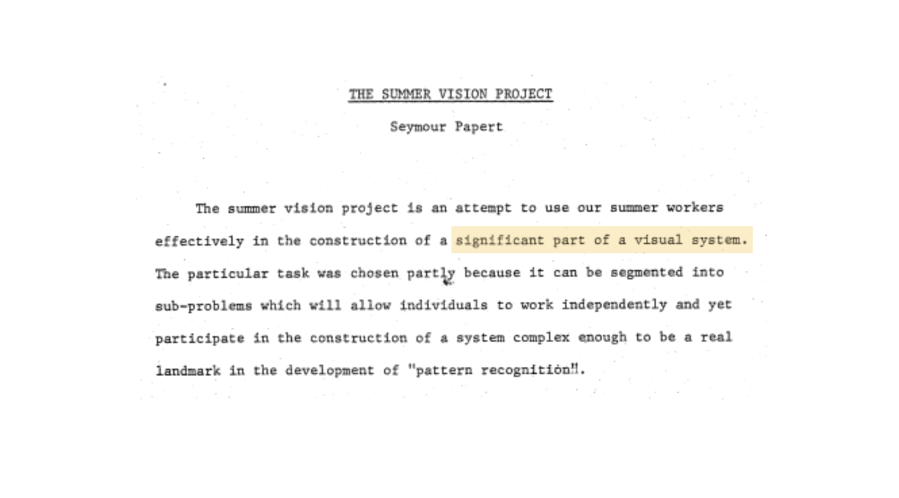
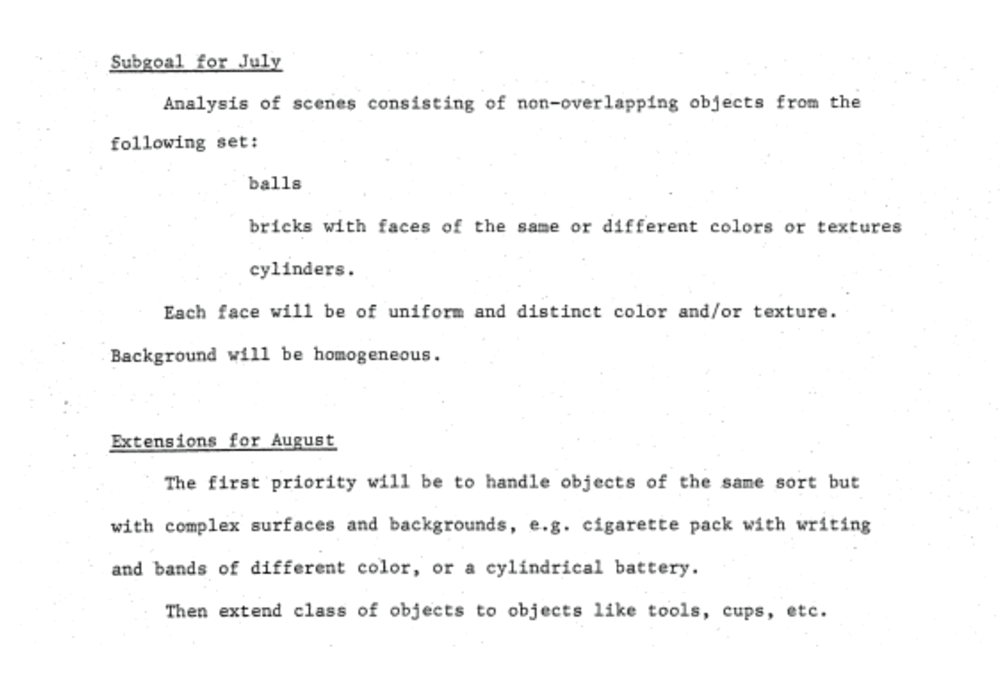
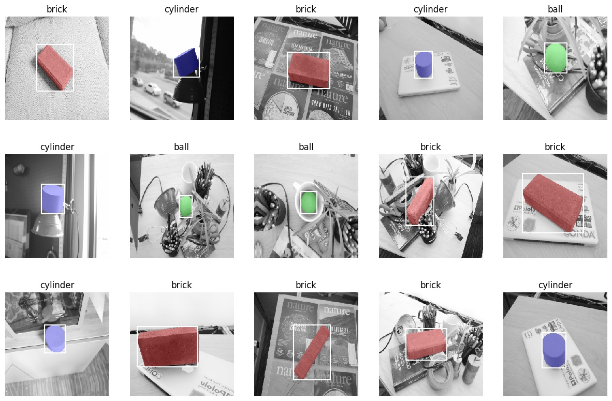

# Deep Learning Programming Challenge

## About This Challenge

In the summer of 1966, Marvin Minsky and Seymour Paper, giants of Artifical Intelligence, launched the 1966 MIT Summer Vision Project: 

Minsky and Papert assigned Gerald Sussman, an MIT undergraduate studunt as project lead, and setup specific goals for the group around recognizing specific objects in images, and seperating these objects from their backgrounds. 

Just how hard is it to acheive the goals Minsky and Papert laid out? How has the field of computer vision advance dsince that summer? Are these tasks trivial now, 50+ years later? Do we understand how the human visual system works? Just how hard *is* computer vision and how far have we come?

In this challenge, we will use a modern tool, **deep neural networks**, and a labeled dataset to solve a version of the MIT Summer Vision Project problem.  

## Data
used the bbc-1k dataset, which contains 1000 images of bricks, balls, and cylinders against cluttered backgrounds.

The BBC-1k dataset includes ~1000 images including classification, bounding box, and segmentation labels. Importantly, each image only contains one brick, ball or cylinder. 

## Packages
numpy, opencv, tdqm, time, pytorch, fastai, opencv, and scipy.

